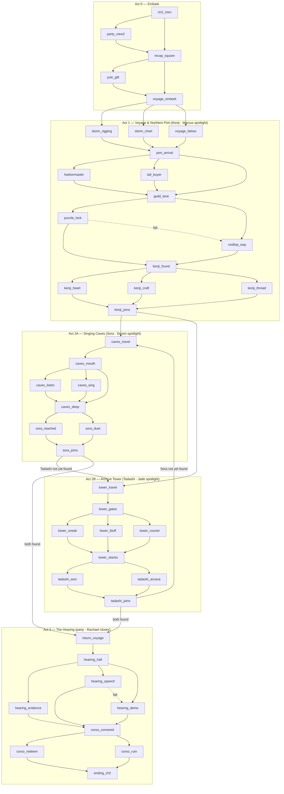

# Chapter 2 Blueprint — "The Concord's Voyage"
**The Scattered Guild · Architect output · 2026-09-07 · STATUS: decisions locked, ready to build**

---

## 0. Assumptions & missing inputs (read first)

The task specified reading `game-forge/CLAUDE.md`, `game-forge/agents/architect.md`, and `game-forge/tasks/chapter-brief.md`. **None of these exist in the repo or the uploaded zip.** Sources actually used:

1. `game-forge/games/scattered-guild/handoff.md` (uploaded 2026-09-07) — design rules, roster, Chapter 2 scope ("Kenji's northern port, Sora's Singing Caves, Tadashi's Archive Tower, Corso confrontation")
2. `scattered-guild.jsx` — the engine's real scene-graph conventions (schema, DC calibration, resolve pattern, item system)

Architect rules were therefore **inferred**: design only, no code; every scene specified to the engine's schema; handoff's four Key Design Rules treated as binding; open decisions surfaced, not silently made. If the real `architect.md` says otherwise, this document should be regenerated against it.

---

## 1. Chapter premise

Chapter 1 ended with Yuki (Thread-Spinner) and Hana (Dyer) allied in Floridae, Captain Tomoe offering passage north, and Corso actively hunting the remaining masters. Chapter 2 is the recovery arc: sail north for **Kenji** (Embroiderer), then — in player-chosen order — the **Singing Caves** for **Sora** (Loom-Singer) and the **Archive Tower** for **Tadashi** (Pattern-Keeper), returning for the **Merchant Council hearing** where Corso is defeated politically, not violently. The chapter closes with all five masters weaving the first threads of the tapestry.

Thematic spine (per handoff): the value is in the connections between crafts, not any single technique. Corso loses because he can't copy a *relationship*.

**Chapter 1 canon: fixed start** (D1 resolved). Yuki allied, Hana allied, Tomoe transport secured, Corso aware of the party. A recap scene establishes this so fresh players aren't lost. Real stat import deferred to when actual students replace NPC slots — fixed canon is correct for a variable party size of 1–4.

---

## 2. Design-rule compliance (handoff §Key Design Rules)

| Rule | How Chapter 2 satisfies it |
|---|---|
| 1. Personalized world object per player | Three new **SWAP-SLOT objects** (§5), one per NPC placeholder, each on that character's arc critical path. Rachael's was the embroidered map (Ch1); Ch2 gives her a *connective* finale role, not a new object. |
| 2. Party's story, not Rachael's | Each act's critical path favors a different character: Marcus → Kenji arc, Devon → Sora arc, Jade → Tadashi arc, Rachael → hearing (support/closer). Audit table in §6. |
| 3. Solo Rachael game separate | Untouched. Nothing here assumes solo play. |
| 4. NPC slots swappable | Every spotlight moment is keyed to a **party slot + skill check with a non-spotlight fallback path** — swap the `CHARACTERS` entry and the scene still plays. `preferChar` references slots, never personalities, in check mechanics; banter lines are flagged for rewrite on swap. |

---

## 3. Scene graph

36 scenes. Same branch-and-reconverge shape as Chapter 1: no dead ends, every failure routes forward with reduced reward.

---

## 4. Scene specifications

Schema matches the engine exactly: `title`, `text` (or `text: null` + `resolve(result, inventory)`), `choices[{text, next, icon, check?, dc?, preferChar?, condition?}]`, `addItem`. Engine conventions honored: nat 20 auto-passes (`result.nat20 || total >= dc`); nat 1 is cosmetic only; scenes entered via a `check` choice must use the `resolve` + `checkedResolveRef` pattern (known bug fix in handoff §Known Bug Fix); `condition` fns read inventory only.

DC calibration follows Chapter 1's observed band (10–14): 10–11 = flavor/easy, 12 = standard, 13 = risky, 14 = hard (Ch1's max, `arcana_check`).

### Act 0 — Embark (4 scenes)

| ID | Type | Checks | Items | Notes |
|---|---|---|---|---|
| `ch2_intro` | static | — | — | Liz: "Chapter Two starts Monday. It's Monday." Grade recap gag; midterm joke callback (Ch1 `ending_good`). Choices → `party_view2`, `recap_square`. |
| `party_view2` | static, `showPartyDetail` | — | — | Liz's margin notes updated to reflect Ch1 growth (one line each). → `recap_square`. |
| `recap_square` | static | — | — | Fountain at dawn; Yuki & Hana see the party off; canon recap woven into dialogue. Choices: "Ask Yuki for a token" → `yuki_gift`; "Board the Painted Shuttle" → `voyage_embark`. |
| `yuki_gift` | static | — | **Spun Starlight** | Optional. Yuki's thread — later unlocks the no-roll path to Kenji (`kenji_thread`). Reward for slowing down; on-theme with the Peace value. → `voyage_embark`. |

### Act 1 — Voyage & Northern Port (14 scenes) — **Marcus spotlight**

| ID | Type | Checks | Items | Notes |
|---|---|---|---|---|
| `voyage_embark` | static | — | — | Storm ahead. Choices: rigging (athletics DC 12) → `storm_rigging`; chart around it (survival DC 13) → `storm_chart`; secure cargo, no check → `voyage_below`. |
| `storm_rigging` | resolve | entered via athletics 12 | pass: **Crew's Respect** | Physical heroics; Marcus-shaped but any char can roll. Fail: Tomoe saves them, no item. Both → `port_arrival`. |
| `storm_chart` | resolve | entered via survival 13 | pass: **Crew's Respect** | Navigation route. Both outcomes → `port_arrival`. |
| `voyage_below` | static | — | **Tomoe's Stories** | Safe path: banter scene; Tomoe tells Kenji's backstory (hands began shaking after the guild broke — grief, not age). → `port_arrival`. |
| `port_arrival` | static | — | — | Northern port; Corso's buyers dockside with ledgers (Ch1 visual callback). Choices: harbormaster (persuasion 12); tail a buyer (stealth 13); Tomoe's directions, no check → `guild_lane`. |
| `harbormaster` | resolve | via persuasion 12 | pass: **Harbor Warning** | Pass: directions + warning that buyers asked about "an old embroiderer." Fail: brushed off; choices → `guild_lane`, `tail_buyer`. |
| `tail_buyer` | resolve | via stealth 13 | pass: **Corso Timetable** | Pass: overhears agents are already headed to the **Archive Tower** (foreshadows Act 2B; unlocks `tower_courier`). Fail: spotted, no chase, → `guild_lane`. |
| `guild_lane` | static | — | — | Shuttered embroidery district behind an iron gate with a mechanical guild lock. **SWAP-SLOT M** (§5). Choices: solve the lock (investigation 12, `preferChar: "marcus"`) → `puzzle_lock`; over the roofs (acrobatics 13) → `rooftop_way`. |
| `puzzle_lock` | resolve | via investigation 12 | pass: **Guild Gate Key** | Marcus's flaw subverted: overthinking is *exactly right* for a five-stage lock — the party watches analysis paralysis become analysis. Fail: jammed → offer `rooftop_way`. |
| `rooftop_way` | resolve | via acrobatics 13 | — | Pass: quiet entry. Fail: loud arrival (flavor only). Both → `kenji_found`. |
| `kenji_found` | static | — | — | Kenji, hands shaking, refuses: "A needle I can't hold is a needle I don't own." Choices: Devon reaches him (insight 11, `preferChar: "devon"`) → `kenji_heart`; Rachael talks craft lineage (history 12) → `kenji_craft`; show Yuki's thread (condition: **Spun Starlight**) → `kenji_thread`. |
| `kenji_heart` | resolve | via insight 11 | — | Pass: names the grief under the shame. Fail: words bounce; fallback choices to `kenji_craft` / `kenji_thread`. → `kenji_joins`. |
| `kenji_craft` | resolve | via history 12 | — | Pass: Rachael proves the knowledge outlives the hands — "You don't have to stitch. You have to *teach*." Fail: fallback to remaining options. → `kenji_joins`. |
| `kenji_thread` | static | condition-gated | — | No roll. Yuki's thread in his palm does what argument can't. Reward for `yuki_gift`. → `kenji_joins`. |
| `kenji_joins` | static | — | **Kenji's Alliance**, **Kenji's Pattern Needle** | He joins *as a teacher*. The Needle is a credential recognized by other masters (unlocks a no-roll path at `tower_stacks`). Choices: → `caves_travel` or `tower_travel` — **player picks arc order**. |

### Act 2A — Singing Caves (7 scenes) — **Devon spotlight**

| ID | Type | Checks | Items | Notes |
|---|---|---|---|---|
| `caves_travel` | static | — | — | Inland trek, short banter beat (rewrite-on-swap flag). → `caves_mouth`. |
| `caves_mouth` | static | — | — | The famous acoustics are *silent* — wrong. Choices: listen (perception 11) → `caves_listen`; sing into the dark (performance 12) → `caves_sing`; go quietly, no check → `caves_deep`. |
| `caves_listen` | resolve | via perception 11 | pass: **Cave Bearings** | Pass: a faint loom-rhythm deeper in. Fail: nothing. Both → `caves_deep`. |
| `caves_sing` | resolve | via performance 12 | pass: **Answered Echo** | Pass: an answering hum — Sora knows they're coming and doesn't flee. Fail: the silence deepens (she heard and withdrew; flavor). Both → `caves_deep`. |
| `caves_deep` | static | — | — | Sora's camp. She hasn't sung since the guild broke — her voice was a *fifth* of something; alone it just echoes. **SWAP-SLOT D** (§5): Devon's Resonance Bowl. Choices: Devon, shared meal + the bowl (persuasion 10, `preferChar: "devon"`) → `sora_reached`; Rachael offers a duet (performance 13) → `sora_duet`; if **Answered Echo**: "She already answered you — just talk" (condition, no roll) → `sora_reached`. |
| `sora_reached` | resolve | via persuasion 10 | — | Pass: Devon doesn't ask her to sing — asks what she misses. Fail: fallback to `sora_duet`. → `sora_joins`. |
| `sora_duet` | resolve | via performance 13 | — | Pass: Rachael starts badly *on purpose* — Sora physically cannot let a pattern stay broken. Fail: fallback to `sora_reached` route. → `sora_joins`. |

`sora_joins` (static): **Sora's Alliance**, **Sora's Song**. Conditional choices: → `tower_travel` (condition: no **Tadashi's Alliance**) or → `return_voyage` (condition: has it).

### Act 2B — Archive Tower (7 scenes) — **Jade spotlight**

| ID | Type | Checks | Items | Notes |
|---|---|---|---|---|
| `tower_travel` | static | — | — | Approach; smoke from the tower chimneys — someone's inside. → `tower_gates`. |
| `tower_gates` | static | — | — | Corso's agents are *already copying archives* (pays off `tail_buyer`). Choices: sneak in (stealth 13, `preferChar: "jade"`) → `tower_sneak`; walk in as visiting scholars (deception 12) → `tower_bluff`; if **Corso Timetable**: intercept the courier at the postern (condition, no roll) → `tower_courier`. |
| `tower_sneak` | resolve | via stealth 13 | pass: **Agent's Ledger** | Pass: reaches the stacks unseen AND lifts the agents' ledger — the chapter's key evidence. Fail: spotted, short chase, arrives loud, no ledger. → `tower_stacks`. |
| `tower_bluff` | resolve | via deception 12 | — | Pass: escorted in politely. Fail: thrown out, back entrance. Both → `tower_stacks`, no ledger. |
| `tower_courier` | static | condition-gated | **Agent's Ledger** | No roll — earlier intel converts directly into evidence. → `tower_stacks`. |
| `tower_stacks` | static | — | — | Tadashi barricaded among the archives; won't leave the patterns, and his catalog is **enciphered**. **SWAP-SLOT J** (§5): the Index Cipher. Choices: Jade cracks it (investigation 12, `preferChar: "jade"`) → `tadashi_won`; Rachael reads it as arcana notation (arcana 14) → `tadashi_arcana`; show **Kenji's Pattern Needle** (condition, no roll) → `tadashi_won`. |
| `tadashi_won` / `tadashi_arcana` | resolve | above | — | Pass: proves the party can *carry* the archive, not just move it — Tadashi's real fear. Fail: fallback to the remaining unlock. Both → `tadashi_joins`. |

`tadashi_joins` (static): **Tadashi's Alliance**, **Master Patterns**. Conditional choices: → `caves_travel` (no **Sora's Alliance**) or → `return_voyage`.

Jade character beat on this arc: cracking the cipher *requires* Tadashi's hints — the "doesn't ask for help" flaw bends. One line, flagged rewrite-on-swap.

### Act 3 — The Hearing (8 scenes) — **party climax, Rachael closes**

| ID | Type | Checks | Items | Notes |
|---|---|---|---|---|
| `return_voyage` | static | — | — | Sailing home, Tomoe brings news: Corso pushed the Merchant Council to an emergency vote banning independent artisans — scheduled the same day as **Hana's Cultural Preservation Hearing** (direct Ch1 `town_search` callback). → `hearing_hall`. |
| `hearing_hall` | static | — | — | All five masters present. Corso confident. **Councilwoman Maren** presides — introduced here as the one honest vote on the council, skeptical of both sides. Choices: present the ledger (condition: **Agent's Ledger**, no roll) → `hearing_evidence`; Rachael addresses the council (persuasion 13) → `hearing_speech`; live demonstration — five masters work one pattern in concert (performance 12) → `hearing_demo`. |
| `hearing_evidence` | static | condition-gated | **Council's Favor** | The ledger proves espionage and coercion. The council turns. → `corso_cornered`. |
| `hearing_speech` | resolve | via persuasion 13 | pass: **Council's Favor** | Rachael's Ch1 flaw pays off: "I know what undervaluing craft looks like — I've done it to myself." Fail: council splits → offered `hearing_demo`. → `corso_cornered`. |
| `hearing_demo` | resolve | via performance 12 | pass: **Council's Favor** | The thesis made visible: the room watches five techniques become one fabric. Fail: still moving, but no Favor. → `corso_cornered`. |
| `corso_cornered` | static | — | — | Corso politically beaten. Devon's Ch1 line pays off ("He's scared. People who do this are always scared of the real thing."). Choices: offer him a seat at the table — as a *merchant*, distribution not production (persuasion 12, `preferChar: "devon"`) → `corso_redeem`; let the council deal with him → `corso_ruin`. |
| `corso_redeem` | resolve | via persuasion 12 | pass: **Corso's Contract** | Pass: the monopolist becomes the Concord's distributor — on their terms. Fail: he refuses — **Councilwoman Maren** (NPC, non-player) steps in and forces the same terms by council vote. Either way → `ending_ch2` with Corso neutralized. Maren's intervention is colder ("This isn't mercy, merchant. This is regulation.") but the Ch3 trigger still fires: Corso is bound to the Concord, willing or coerced. |
| `corso_ruin` | static | — | — | Player chose no mercy. **Councilwoman Maren** (NPC) formally strips Corso's guild license. He's done — but his agent network survives (Ch3 seed: the agents go rogue without a handler). Maren's vote makes the outcome *official*, not just dramatic. → `ending_ch2`. |
| `ending_ch2` | resolve(–, inventory) | — | — | Graded ending, same mechanism as Ch1 `accept_quest`. Quest log + tapestry scene: five masters, first threads. Liz closer + Ch3 hook ("The tapestry is your final exam. It's worth 100% of your grade." / Devon: "OF WHICH CLASS?"). Restart → `ch2_intro`. |

**Councilwoman Maren** — non-player NPC introduced in `hearing_hall`. Serves as the narrative guarantor: regardless of which path the player takes or whether persuasion rolls pass or fail, Maren's council authority ensures the Corso resolution *sticks* and the Ch3 trigger fires. She's the legal weight behind whatever the party accomplishes socially.

**Grading logic** (mirrors Ch1's item-count tiers): the three Alliances always print ✅; total items ≥ 9 → A-range, ≥ 6 → B+, else C+. **Corso's Contract** upgrades the epilogue text, not the grade (mercy shouldn't be min-maxed).

**Spotlight dice amplification** (D3): when a `preferChar` roll is made by the *preferred* character, amplify the result cosmetically. Nat 20 → "WINNER WINNER" flash banner + extra Liz commentary ("Show-off. A+."). Nat 1 → "EPIC FAIL" flash + Liz roast + extra party banter. This is visual only — the pass/fail mechanic is unchanged. Builder adds a one-line `isSpotlight` flag to `DiceRollPanel` when the rolling character matches `preferChar`; no persistent tracking, no inventory pollution.

---

## 5. SWAP-SLOT objects (Design Rule 1)

Placeholder objects for placeholder NPCs — each keyed to the sheet, marked for replacement when real student sheets arrive. Each sits on its arc's critical path but has a fallback (Rule 4).

| Slot | Character (placeholder) | Object | Mirrors | Fallback if swapped/failed |
|---|---|---|---|---|
| **M** | Marcus (smith's tools, tactics, analysis paralysis) | **Quartermaster's Puzzle-Lock** — five-stage mechanical guild lock; overthinking wins | Systems thinking, hands-on building | `rooftop_way` (acrobatics 13) |
| **D** | Devon (cook's utensils, painter's supplies, empathy) | **Resonance Bowl** — a shared meal in a painted bowl whose rim hums; connection before performance | Care work, food, art | `sora_duet` (performance 13) |
| **J** | Jade (navigator's tools, data-over-people) | **Index Cipher** — Tadashi's enciphered catalog; a data problem guarding a human one | Pattern-finding, systems, the terminal | `tadashi_arcana` (arcana 14) or Needle credential |

On swap: replace the object + one flavor paragraph per scene; check skill may change to match the new sheet (e.g., a coder inherits the cipher naturally; a cook inherits the bowl). The graph shape does not change.

Rachael intentionally gets no new object: her Ch2 role is the connective one (craft-talk with Kenji, duet option with Sora, the hearing speech built on her own flaw) — support in every arc, protagonist of none (Rule 2).

---

## 6. Spotlight audit (Design Rule 2)

| Character | Critical-path moment | Optional moments | preferChar uses |
|---|---|---|---|
| Marcus | Puzzle-Lock → Kenji | storm rigging, harbormaster | `puzzle_lock` entry |
| Devon | Resonance Bowl → Sora | `kenji_heart`, Corso mercy | `kenji_found` choice, `caves_deep`, `corso_cornered` |
| Jade | Index Cipher + Ledger → Tadashi/evidence | `tail_buyer` | `tower_gates` |
| Rachael | Hearing speech (one of three closers) | `kenji_craft`, `sora_duet`, `tadashi_arcana` | none — deliberately |

Every check remains open to any party member (engine's CharPicker), so these are incentives, not locks.

## 7. Item economy (16 items)

Mandatory: Kenji's/Sora's/Tadashi's Alliance, Kenji's Pattern Needle, Sora's Song, Master Patterns (6).
Earnable: Spun Starlight, Crew's Respect, Tomoe's Stories, Harbor Warning, Corso Timetable, Guild Gate Key, Cave Bearings, Answered Echo, Agent's Ledger, Council's Favor, Corso's Contract (max ~13–14 in one run; some are mutually exclusive by routing).

Cross-scene payoffs: Spun Starlight → `kenji_thread`; Corso Timetable → `tower_courier`; Kenji's Pattern Needle → `tower_stacks` no-roll unlock; Agent's Ledger → `hearing_evidence`; Answered Echo → `sora_reached` no-roll unlock. Every optional pickup pays off later — nothing is grade-filler only.

## 8. Engine deltas required (Builder's list — small)

1. **New file**: Ch2 is its own `scattered-guild-ch2.jsx` + `scattered-guild-ch2.html` (D2). Shares `CHARACTERS`, `SKILL_STATS`, helper functions, and all UI components from Ch1 (import or copy). Ch2 has its own `SCENES` object, its own `Game()` entry point starting at `ch2_intro`.
2. Title bar: `"Ch.2 — The Concord's Voyage"`.
3. Restart target: `"ch2_intro"` in `ending_ch2` and `handleChoice` restart.
4. No `SKILL_STATS` changes — every check uses an existing skill.
5. No schema changes — `condition`, `preferChar`, `addItem`, `resolve` all already supported.
6. The two conditional-routing joins (`sora_joins`/`tadashi_joins`) use existing `condition` on choices — but note the engine *hides* failed-condition choices, so each must carry both choices with complementary conditions or the player can strand. Builder must test both arc orders.
7. Known bug (handoff): every check-entered scene here uses `resolve` — the `checkedResolveRef` path. No `text`+`resolve` mixing.
8. **Spotlight amplification** (D3): add `isSpotlight` boolean to `DiceRollPanel` — true when rolling character matches `preferChar`. On nat 20: "WINNER WINNER" flash banner, bonus Liz quip, extra glow animation. On nat 1: "EPIC FAIL" flash, Liz roast, party banter. Visual only — does not change pass/fail outcome or persist anything.

## 9. Decisions (locked 2026-09-07)

| # | Decision | Resolution | Rationale |
|---|---|---|---|
| D1 | Chapter 1 carryover | **Fixed canon start** | Correct for 1–4 NPC-filled slots; real stat import when actual students join |
| D2 | File structure | **Separate file** (`scattered-guild-ch2.jsx`) | Keeps files small, independent |
| D3 | Spotlight tracking | **Amplified dice feedback only** — "WINNER WINNER" on nat 20, "EPIC FAIL" on nat 1, when preferred char rolls their spotlight check | No persistent tracking, no inventory pollution; just a flash moment |
| D4 | Corso resolution guarantee | **NPC guarantor (Councilwoman Maren)** ensures Corso trigger fires regardless of player path or roll outcome | Corso neutralized on every branch; Ch3 seed differs by path (willing contract vs. rogue agents) |

---
*Decisions locked. Blueprint approved for build.*
